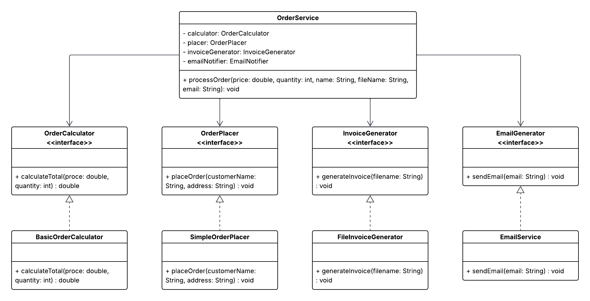

# SOLID Principles in Java - Order Management System

## Project Description

This project demonstrates the application of SOLID principles in Object-Oriented Programming (OOP) using Java. 

The original implementation of the order system had multiple responsibilities in a single interface and class, making the code difficult to maintain, extend, and reuse. This project refactors that design into a modular and scalable structure by applying SOLID principles.

---

## Problem Statement

The initial system design had the following issues:

- A single interface handled multiple responsibilities:
  - Order calculation
  - Order placement
  - Invoice generation
  - Email notification

- Violations of SOLID principles:
  - **Single Responsibility Principle (SRP)** – One class handled multiple tasks
  - **Interface Segregation Principle (ISP)** – Classes were forced to implement unused methods
  - **Open/Closed Principle (OCP)** – Difficult to extend without modifying code
  - **Dependency Inversion Principle (DIP)** – High-level modules depended on concrete implementations

These issues resulted in tightly coupled and less maintainable code.

---

## Activity / Implementation

The system was refactored into the following components:

### 1. Interfaces (Abstraction Layer)
- `OrderCalculator`
- `OrderPlacer`
- `InvoiceGenerator`
- `EmailNotifier`

Each interface now has a **single responsibility**.

### 2. Implementations (Concrete Classes)
- `BasicOrderCalculator`
- `SimpleOrderPlacer`
- `FileInvoiceGenerator`
- `EmailService`

Each class implements only the interface it needs.

### 3. Service Layer
- `OrderService`

This class coordinates all operations using **dependency injection**, allowing flexibility and easy modification.

### 4. Main Class
- `Main.java`

Used to test and run the application.

---

## SOLID Principles Applied

- **Single Responsibility Principle (SRP)**: Each class has only one responsibility.
- **Open/Closed Principle (OCP)**: The system can be extended (e.g., adding new payment methods) without modifying existing code.
- **Liskov Substitution Principle (LSP)**: All implementations can replace their interfaces without affecting functionality.
- **Interface Segregation Principle (ISP)**: Interfaces are small and specific, so classes only implement what they need.
- **Dependency Inversion Principle (DIP)**: High-level modules depend on abstractions, not concrete classes.

--- 

Below is the **UML Class Diagram** for this project:

